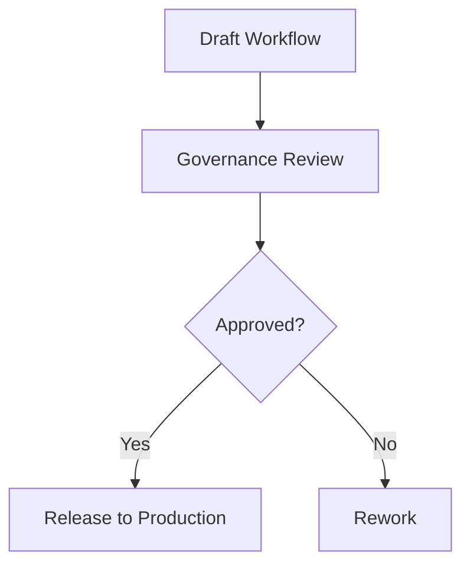

# AIGIS — AI Governance and Infrastructure Suite for Obsidian

> **v0.1.2** · By [Dialogistic Industries](https://dialogisticindustries.com/)

A lightweight version of [AIGIS: The AI Governance and Infrastructure Suite](https://dialogisticindustries.com/solutions/software/aigis/) built specifically for Obsidian. It gives you a centralized command center for every AI model you deploy, with a formal inventory, prompts, a skills repository for reusable agent capabilities, guardrails, and an audit trail.

---

## Contents

- [[#What is AIGIS?]]
- [[#Vault Structure]]
- [[#Modules]]
  - [[#AI Inventory]]
  - [[#Prompts]]
  - [[#Policies]]
  - [[#Workflows]]
  - [[#Skills]]
  - [[#Incidents]]
  - [[#Audit Log]]
  - [[#Dashboard]]
  - [[#Console Panel]]
- [[#Installation]]
  - [[#Option A — Open this repo as a new vault]]
  - [[#Option B — Add to an existing vault]]
  - [[#Development mode]]
- [[#Command Reference]]
- [[#Settings]]
- [[#Frontmatter Reference]]

---

## What is AIGIS?

**AIGIS** is an Obsidian community plugin that brings structured AI governance workflows into your note-taking environment. It is a focused adaptation of the [AIGIS WordPress plugin](https://dialogisticindustries.com/solutions/software/aigis/), keeping the modules that map naturally to Markdown notes while omitting the parts that require a live server (live API sandbox, usage analytics, cost budgets, REST API).

The result is a lightweight but opinionated governance workspace: every AI model you operate, every governed prompt, every formal policy, every approved workflow, every reusable skill, and every incident you investigate lives as a structured Markdown note with consistent frontmatter. An append-only audit note records every action the plugin takes.

**What it is for:**
- Individuals and small teams who want rigour around their AI tooling without running a full platform.
- Compliance-track organisations who need a documented evidence base and prefer to own their data locally.
- Prompt engineers and AI developers who want version-controlled, lifecycle-managed prompt artefacts.

**What it is not:**
- It does not call any AI provider or run prompts — it is purely a governance record.
- It does not provide real-time usage analytics or cost tracking (those require a server-side component).
- It is not a replacement for the full AIGIS WordPress plugin if you need a multi-user web interface.

---

## Vault Structure

The plugin manages a single root folder inside your vault (default: `AIGIS/`). Run **AIGIS: Bootstrap governance vault** once after enabling the plugin to create the full structure and the dashboard.

```
AIGIS/
├── Dashboard.md               ← auto-generated, regenerated on every change
├── Inventory/
│   └── your-model-record.md
├── Prompts/
│   └── policy-summariser.md
├── Policies/
│   └── acceptable-use-policy.md
├── Workflows/
│   └── model-deployment-approval.md
├── Skills/
│   └── complaint-triage.md
├── Incidents/
│   └── prompt-injection-blocked.md
└── Audit/
    └── Audit Log.md           ← append-only, never edited by hand
```

> **Tip:** The root folder name, audit folder name, and dashboard filename are all configurable in **Settings → AIGIS Governance**. You can change them before or after bootstrapping — just update the setting and re-bootstrap to recreate the structure in the new location.

---

## Modules

Each module stores a specific kind of governance artefact as a Markdown note with structured YAML frontmatter. All six modules follow the same pattern: open the console or run a command, fill in a short form, and a ready-to-edit note is created in the right folder.

---

### AI Inventory

The **Inventory** module is the foundation of the governance workspace. Every other module can reference an inventory record by linking to its note.

| Field | Description |
|---|---|
| `vendor` | The organisation or provider operating the model (e.g. OpenAI, Anthropic, Meta). |
| `model` | Model name and version (e.g. `gpt-4.1`, `claude-opus-4`, `llama3:8b`). |
| `integration_type` | `api-model` — cloud API. `custom-agent` — bespoke orchestration. `on-prem` — self-hosted. |
| `risk_level` | `low`, `medium`, or `high` based on data sensitivity and blast radius if misused. |
| `owner` | Team or person responsible for this model deployment. |
| `status` | `active`, `deprecated`, or `under-review`. Deprecated records are kept for audit linkage. |

Generated notes include **Overview**, **Governance Notes** (data categories, human review expectations, linked policies), and **Operational Context** (agent identifier, endpoint, dependencies).

---

### Prompts

Prompts are system instructions, templates, or personas used with AI models. AIGIS treats them as version-controlled artefacts with a defined lifecycle stage.

**Lifecycle stages:**
- **Development** — in active iteration, not yet approved for use.
- **Staging** — review-ready, being tested before production clearance.
- **Production** — approved and cleared for use in governed workflows.

Update the `stage` frontmatter field manually as a prompt progresses.

Generated notes include **Purpose** (populated from the Goal field), **Prompt Body** (paste the actual prompt text here), and **Review Notes** (promotion criteria, edge cases, linked inventory record).

---

### Policies

Policies are formal governance documents that define permitted uses of AI, prohibitions, and consequences of non-compliance. The auto-generated dashboard surfaces the five nearest upcoming `review_date` values.

**Status values:** `draft` → `approved` → `retired`

**Best practice:**
- Always assign an `owner` field so responsibility is traceable.
- Set a `review_date` no more than 12 months from the `effective_date`.
- Cross-link policies to the inventory records they govern using Obsidian wiki-links.

---

### Workflows

Workflow notes document approved AI-assisted processes: the sequence of steps, where human oversight is mandatory, and what automated decisions are permissible. Each note is generated with a Mermaid diagram block pre-populated from the form.



**Best practice:**
- Mark every node where a human must review output before proceeding.
- Note in the **Oversight Notes** section what evidence a reviewer needs to sign off.
- Cross-link to the relevant Policy notes that authorise the workflow.

---

### Skills

A **skill** is a reusable governed capability — an instruction bundle that tells an agent what to do, when to do it, and what its output must look like.

| Field | Purpose |
|---|---|
| `trigger_phrases` | The phrases or conditions that should cause an agent to invoke this skill. One phrase per line. |
| `output_contract` | The mandatory structure of the skill's output. State exact section names or formats required. |
| `team` | The team that owns and is responsible for reviewing this skill. |
| `version` | A version tag so you can track iterations (e.g. `1.0.0`). |

Generated notes include **Capability Summary**, **Method** (the actual instruction body), and **Readiness Review** (edge cases, linked prompts, workflows, policies, and incidents).

> Always populate the **output contract** before using a skill in production. Vague output contracts are the most common cause of inconsistent agent behaviour.

---

### Incidents

Log and investigate AI incidents here — PII leakage in outputs, prompt injection attempts, misuse, or unexpected model behaviour.

**Severity levels:** `low` · `medium` · `high` · `critical`

**Status flow:** `open` → `investigating` → `resolved`

Generated notes include **Incident Summary** (populated from the form), **Investigation** (detection time, containment, root cause), and **Resolution** (owner, follow-up actions, control changes required).

---

### Audit Log

The audit log at `AIGIS/Audit/Audit Log.md` is an append-only record written by the plugin. Never manually delete lines from it.

**Format:**
```
- 2026-04-22T14:33:01.000Z | vault.bootstrap | AIGIS governance vault bootstrapped.
- 2026-04-22T14:35:20.000Z | note.created | Inventory note created: Customer Support GPT | module=inventory, file=AIGIS/Inventory/customer-support-gpt.md
```

**Logged actions:**
- `vault.bootstrap` — vault structure created or re-bootstrapped.
- `note.created` — any governance note created through the plugin.

> **Warning:** The audit log is a plain Markdown file. Treat it as advisory evidence rather than a cryptographic audit trail. For regulatory use cases, export the file regularly and store a copy outside the vault.

---

### Dashboard

`AIGIS/Dashboard.md` is regenerated automatically every time a managed note is created, deleted, or renamed. It contains:
- A count of notes in each module folder with a wiki-link to the folder.
- Quick links to the audit log and workspace README.
- The five nearest upcoming policy `review_date` values, sorted chronologically.

---

### Console Panel

The **AIGIS Console** is a persistent side panel in Obsidian's right sidebar. Open it via the shield icon in the ribbon or with **AIGIS: Open governance console**.

- One card per **visible** module shows the live note count (displayed in the card header, right-aligned) and a **Create** button.
- Three quick-action buttons at the bottom: **Bootstrap vault**, **Open dashboard**, **Open audit log**.
- Modules toggled off in **Settings → Console visibility** do not appear in the console at all.
- Card order and card appearance (colours, fonts, borders) are configurable in Settings.

---

## Installation

### Option A — Open this repo as a new vault

The `AIGIS-Obsidian` repository is a self-contained vault with the compiled plugin already included — no build step required.

1. Launch Obsidian → **Open another vault** → **Open folder as vault** → select the `AIGIS-Obsidian` folder.
2. Go to **Settings → Community Plugins**. If prompted, turn off Restricted Mode. Find **AI Governance and Infrastructure Suite for Obsidian** and toggle it on.
3. Open the command palette (`Ctrl/Cmd + P`) and run **AIGIS: Bootstrap governance vault**.

### Option B — Add to an existing vault

1. In your vault, navigate to `<your-vault>/.obsidian/plugins/` and create a sub-folder named `aigis-governance`.
2. Copy `main.js`, `manifest.json`, and `styles.css` from the repository into that folder.
3. In Obsidian, go to **Settings → Community Plugins → Reload plugins**, then find and enable the plugin.
4. Optionally set the **Root folder** in **Settings → AIGIS Governance** to your preferred path.
5. Run **AIGIS: Bootstrap governance vault** from the command palette.

### Development mode

If you want to modify the plugin source, run the watcher which rebuilds `main.js` on every file save:

```bash
cd ".obsidian/plugins/aigis-governance"
npm install
npm run dev
```

After saving a change, use *Ctrl/Cmd + P → Reload app without saving* in Obsidian to hot-reload the plugin.

---

## Command Reference

All commands are available from the command palette (`Ctrl/Cmd + P`).

| Command | Description |
|---|---|
| `AIGIS: Bootstrap governance vault` | Creates the folder structure, audit log, and dashboard if they do not exist. Safe to re-run. |
| `AIGIS: Open governance console` | Opens or focuses the AIGIS Console side panel. |
| `AIGIS: Create Inventory record note` | Opens the inventory creation form. |
| `AIGIS: Create Prompt note` | Opens the prompt creation form. |
| `AIGIS: Create Policy note` | Opens the policy creation form. |
| `AIGIS: Create Workflow note` | Opens the workflow creation form (includes a Mermaid starter diagram). |
| `AIGIS: Create Skill note` | Opens the skill creation form. |
| `AIGIS: Create Incident note` | Opens the incident creation form. |

---

## Settings

Access at **Settings → AIGIS Governance**.

### General

| Setting | Default | Description |
|---|---|---|
| Root folder | `AIGIS` | Top-level vault folder the plugin manages. |
| Audit folder | `Audit` | Sub-folder within the root where the append-only audit note is stored. |
| Dashboard note | `Dashboard.md` | Filename for the auto-generated dashboard inside the root folder. |
| Auto-open console | on | Whether to open the AIGIS Console side panel automatically when Obsidian loads. |

### Console visibility

Toggle which modules appear as cards in the AIGIS Console. A module toggled **off** is hidden entirely — its card will not render in the console at all. Visibility is controlled here in Settings only, not from the console itself.

Each of the six modules (Inventory, Prompts, Policies, Workflows, Skills, Incidents) has an individual toggle, defaulting to on.

### Card order

Use the **↑** and **↓** arrow buttons to reorder the module cards in the console. Changes take effect immediately.

### Console appearance

Customise font sizes, colours, borders, and padding. Leave any field blank to use the active Obsidian theme's default.

| Setting | Default | Accepts |
|---|---|---|
| Card background | theme default | CSS colour — `#1e2030`, `rgba(0,0,0,0.4)` |
| Card padding | `0.9rem` | CSS spacing — `0.9rem`, `12px 16px` |
| Card border colour | theme default | CSS colour |
| Card border width | `1px` | CSS length — `1px`, `2px` |
| Card border radius | `12px` | CSS length — `12px`, `0.5rem` |
| Title font size | `1rem` | CSS font-size — `1rem`, `14px` |
| Title colour | theme default | CSS colour |
| Count font size | `1.1rem` | CSS font-size |
| Count colour | theme default | CSS colour |
| Description font size | `0.85rem` | CSS font-size |
| Description colour | theme default | CSS colour |
| Button color | theme default | CSS colour for the create button background |
| Button font color | theme default | CSS colour for the create button text |
| Button font size | `0.85rem` | CSS font-size |

A **Reset appearance to defaults** button restores all appearance settings at once.

### Manage dropdown lists

These lists back the **vendor**, **model**, and **team** fields in note creation forms. Three lists are maintained: Vendors / Providers, Models, and Teams.

- Use the **Add** button (or press `Enter`) to add a new value.
- Use the **Remove** button beside any item to delete it.
- Alternatively, choose **＋ Add new…** from within any creation form to add a value on the fly.

---

## Frontmatter Reference

Every note created by the plugin includes these system-level frontmatter fields:

| Field | Present in | Description |
|---|---|---|
| `aigis_module` | All notes | The module type: `inventory`, `prompts`, `policies`, `workflows`, `skills`, or `incidents`. |
| `title` | All notes | The human-readable title entered in the creation form. |
| `created_at` | All notes | ISO-8601 timestamp written at creation time. |
| `updated_at` | All notes | ISO-8601 timestamp at creation (update manually on edit). |

All other frontmatter fields are module-specific and match the form fields described in each module section above.

### Example Dataview queries

```dataview
TABLE vendor, model, risk_level, status
FROM "AIGIS/Inventory"
SORT risk_level DESC
```

```dataview
TABLE status, review_date, owner
FROM "AIGIS/Policies"
WHERE review_date <= date(today) + dur(60 days)
SORT review_date ASC
```

---

*AIGIS — AI Governance and Infrastructure Suite for Obsidian · v0.1.2 · MIT License*  
*By [Dialogistic Industries](https://dialogisticindustries.com/)*
